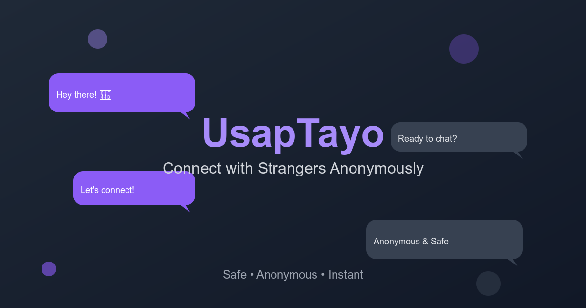

# 💬 UsapTayo - Anonymous Chat Platform

**UsapTayo** is a modern, real-time anonymous chat platform where users can connect with strangers and have meaningful conversations in a safe and friendly environment.



## 🌟 Features

- **Anonymous Chatting**: Connect with strangers without revealing personal information
- **Real-time Messaging**: Instant message delivery powered by Firebase Firestore
- **Mobile Responsive**: Optimized for both desktop and mobile devices
- **Smart Matchmaking**: Intelligent user pairing system
- **Session Management**: Automatic cleanup and fresh starts for privacy
- **Community Guidelines**: Built-in safety measures and user agreements
- **Modern UI**: Clean, intuitive interface with smooth animations

## 🚀 Live Demo

Visit the live application: [https://usaptayo.vercel.app](https://usaptayo.vercel.app)

## 🛠️ Technology Stack

- **Frontend**: React 18 with Hooks
- **Backend**: Firebase (Firestore, Authentication)
- **Hosting**: Vercel
- **Analytics**: Vercel Analytics
- **Styling**: Custom CSS with responsive design
- **State Management**: React useState and useEffect

## 📱 App Flow

1. **Homepage**: Welcome screen with community guidelines and age verification
2. **Nickname Setup**: Choose a display name for the chat session
3. **Matchmaking**: Wait for the system to pair you with another user
4. **Chat**: Real-time conversation with automatic message syncing
5. **End Chat**: Option to leave and return to matchmaking

## 🔧 Installation & Setup

### Prerequisites

- Node.js (v14 or higher)
- npm or yarn
- Firebase project with Firestore enabled

### Local Development

1. **Clone the repository**
   ```bash
   git clone https://github.com/yourusername/usaptayo-chat.git
   cd usaptayo-chat
   ```

2. **Install dependencies**
   ```bash
   npm install
   ```

3. **Configure Firebase**
   - Create a new Firebase project at [Firebase Console](https://console.firebase.google.com)
   - Enable Firestore Database
   - Enable Authentication with Anonymous sign-in
   - Copy `.env.example` to `.env`
   - Replace the placeholder values in `.env` with your actual Firebase config

4. **Start the development server**
   ```bash
   npm start
   ```

5. **Open your browser**
   - Navigate to [http://localhost:3000](http://localhost:3000)

### Production Build

```bash
npm run build
```

This creates an optimized production build in the `build` folder.

## 🔥 Firebase Configuration

Create a `.env` file in your project root and add your Firebase configuration:

```bash
# Copy .env.example to .env and replace with your values
cp .env.example .env
```

Then edit `.env` with your Firebase config:

```bash
REACT_APP_FIREBASE_API_KEY=your-api-key
REACT_APP_FIREBASE_AUTH_DOMAIN=your-project.firebaseapp.com
REACT_APP_FIREBASE_PROJECT_ID=your-project-id
REACT_APP_FIREBASE_STORAGE_BUCKET=your-project.firebasestorage.app
REACT_APP_FIREBASE_MESSAGING_SENDER_ID=your-sender-id
REACT_APP_FIREBASE_APP_ID=your-app-id
REACT_APP_FIREBASE_MEASUREMENT_ID=your-measurement-id
```

**Important Notes:**
- The app includes fallback values for development, so it will work even without a `.env` file
- Always restart your development server after creating or modifying the `.env` file
- Environment variables in React must be prefixed with `REACT_APP_`
- For production deployments (like Vercel), set these variables in your hosting platform's environment settings

**Note**: The `.env` file is automatically ignored by Git for security.

### Firestore Rules

Set up the following security rules in your Firestore database:

```javascript
rules_version = '2';
service cloud.firestore {
  match /databases/{database}/documents {
    // Users can read and write their own user document
    match /users/{userId} {
      allow read, write: if request.auth != null && request.auth.uid == userId;
    }
    
    // Chat documents
    match /chats/{chatId} {
      allow read, write: if request.auth != null && 
        request.auth.uid in resource.data.users;
      
      // Messages within chats
      match /messages/{messageId} {
        allow read, write: if request.auth != null;
      }
    }
  }
}
```

## 📁 Project Structure

```
usaptayo-chat/
├── public/
│   ├── index.html
│   ├── og-image.png
│   └── manifest.json
├── src/
│   ├── App.js          # Main application component
│   ├── App.css         # Styles and responsive design
│   └── index.js        # React entry point
├── build/              # Production build output
├── package.json
└── README.md
```

## 🎨 Key Components

### Main App Component
- **State Management**: Handles user authentication, chat states, and UI notifications
- **Firebase Integration**: Real-time database listeners and user management
- **Route Handling**: Dynamic UI rendering based on application state

### UI Components
- **Homepage**: Welcome screen with guidelines
- **LoadingScreen**: Loading states and waiting screens
- **NicknamePrompt**: User registration form
- **MatchmakingScreen**: User pairing interface
- **ChatPage**: Real-time messaging interface
- **ChatMessage**: Individual message components
- **NotificationToast**: User feedback system

## 🔒 Privacy & Security

- **Anonymous Authentication**: No personal information required
- **Temporary Sessions**: User data is cleared when leaving the app
- **Age Verification**: Users must confirm they are 18+ to use the platform
- **Community Guidelines**: Built-in safety rules and user agreements
- **Automatic Cleanup**: Session data is automatically removed on app close

## 📱 Mobile Optimization

- **Responsive Design**: Optimized for all screen sizes
- **Touch-Friendly**: Large buttons and easy navigation
- **Viewport Handling**: Dynamic viewport height for mobile browsers
- **Performance**: Optimized loading and smooth animations

## 🚀 Deployment

### Vercel Deployment

1. **Install Vercel CLI**
   ```bash
   npm i -g vercel
   ```

2. **Deploy to Vercel**
   ```bash
   vercel --prod
   ```

3. **Configure Environment**
   - Set up custom domain if needed
   - Configure analytics in Vercel dashboard

## 📊 Analytics

The app includes Vercel Analytics for tracking:
- Page views and user sessions
- User engagement metrics
- Performance monitoring
- Geographic distribution

## 🤝 Contributing

1. Fork the repository
2. Create a feature branch (`git checkout -b feature/AmazingFeature`)
3. Commit your changes (`git commit -m 'Add some AmazingFeature'`)
4. Push to the branch (`git push origin feature/AmazingFeature`)
5. Open a Pull Request

## 📝 Available Scripts

### `npm start`
Runs the app in development mode at [http://localhost:3000](http://localhost:3000)

### `npm test`
Launches the test runner in interactive watch mode

### `npm run build`
Builds the app for production to the `build` folder

### `npm run eject`
**Note: This is a one-way operation!** Removes the single build dependency from your project.

## 🐛 Troubleshooting

### Common Issues

1. **Firebase Connection Issues**
   - Verify your Firebase configuration
   - Check Firestore security rules
   - Ensure Anonymous authentication is enabled

2. **Build Errors**
   - Clear npm cache: `npm cache clean --force`
   - Delete node_modules and reinstall: `rm -rf node_modules && npm install`

3. **Mobile Issues**
   - Check viewport meta tags
   - Verify CSS media queries
   - Test on actual devices

## 📄 License

This project is licensed under the MIT License - see the [LICENSE](LICENSE) file for details.

## 🙏 Acknowledgments

- **Firebase** for real-time database and authentication
- **Vercel** for hosting and analytics
- **React** for the frontend framework
- **Create React App** for the initial project setup

## � Troubleshooting

### Environment Variables Not Loading

If you're getting Firebase errors or the app isn't working:

1. **Restart the development server** after creating or modifying `.env`
2. **Check variable names** - they must be prefixed with `REACT_APP_`
3. **Verify .env file location** - it should be in the project root, not in `src/`
4. **Check for syntax errors** in `.env` - no spaces around `=`, no quotes needed for values
5. **Clear browser cache** and refresh the page

### Common Issues

- **"Firebase invalid API key"** - Usually means environment variables aren't loaded (restart dev server)
- **"Permission denied"** - Check your Firebase Firestore rules
- **Mobile UI issues** - Test on actual mobile devices, not just browser dev tools
- **Chat not working** - Verify Firebase project is active and billing is enabled

### Development vs Production

- **Development**: App works with fallback values even without `.env`
- **Production**: Must set environment variables in your hosting platform (Vercel, Netlify, etc.)

## �📞 Support

For support, email support@usaptayo.com or open an issue on GitHub.

---

**Made with ❤️ for meaningful conversations**

### Analyzing the Bundle Size

This section has moved here: [https://facebook.github.io/create-react-app/docs/analyzing-the-bundle-size](https://facebook.github.io/create-react-app/docs/analyzing-the-bundle-size)

### Making a Progressive Web App

This section has moved here: [https://facebook.github.io/create-react-app/docs/making-a-progressive-web-app](https://facebook.github.io/create-react-app/docs/making-a-progressive-web-app)

### Advanced Configuration

This section has moved here: [https://facebook.github.io/create-react-app/docs/advanced-configuration](https://facebook.github.io/create-react-app/docs/advanced-configuration)

### Deployment

This section has moved here: [https://facebook.github.io/create-react-app/docs/deployment](https://facebook.github.io/create-react-app/docs/deployment)

### `npm run build` fails to minify

This section has moved here: [https://facebook.github.io/create-react-app/docs/troubleshooting#npm-run-build-fails-to-minify](https://facebook.github.io/create-react-app/docs/troubleshooting#npm-run-build-fails-to-minify)
